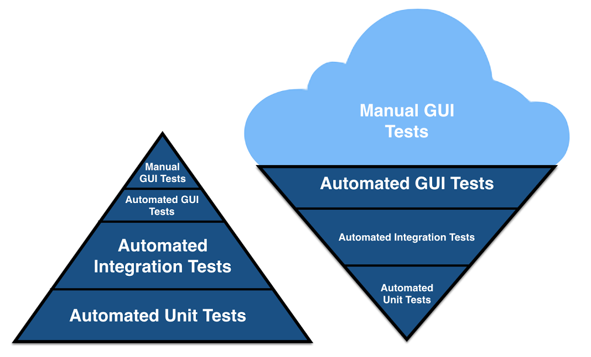

# SDET with Sparta Global

Whilst being trained in SDET (Software Development Engineer in Test), this will be the main directory for all the work completed in the Academy.

# Main Technologies that are used:
#### Ruby
#### RSpec
#### Cucumber
#### JSON
#### XML
#### Capybara
#### YAML
#### Httparty

# Overview

RSPEC is a unit test framework that we will be working with and which is mostly used in the industry.

# Types of testing include:
##### Unit
##### GUI
##### Integration
##### API
##### Component
##### Manual
##### TDD
##### BDD

## The Cone of Hell and the Testing Pyramid of Happiness can be conveyed as so:

